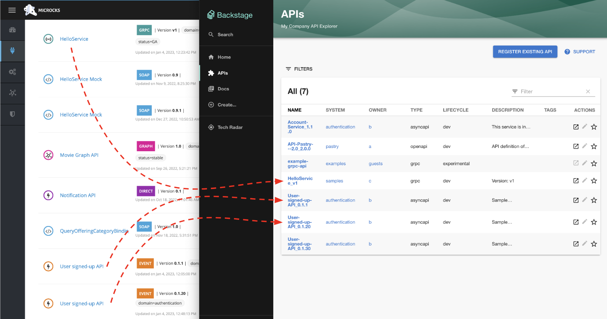
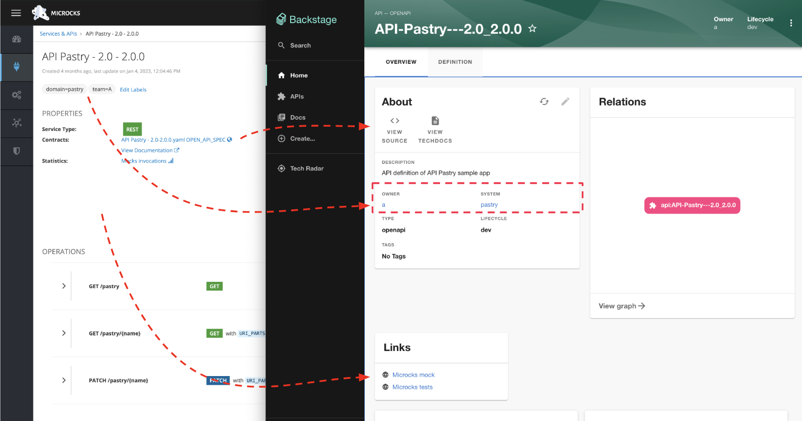

# Microcks Backstage provider

[]((https://search.maven.org/artifact/io.github.microcks/microcks))
[](https://www.apache.org/licenses/LICENSE-2.0)
[](https://microcksio.zulipchat.com/)

This is a plugin for synchronizing Microcks content into [Backstage.io](https://backstage.io/) catalog.

The `microcks-backstage-provider` has a special entity provider for discovering catalog [API entities](https://backstage.io/docs/features/software-catalog/system-model#api) defined in one or many Microcks instances. If you're using Microcks to discover APIs from your Git repositories, auto-publish smart mock endpoints and realize contract testing of your components, this provider can synchronize the API definitions from Microcks into your Backstage intance.

## Screenshots

Your Services and API from different Microcks instances can be discovered and imported into your Backstage catalog.

<a href="./assets/discovery-and-import.png">
   
</a>


Labels on your API in Microcks are be translated onto Backstage systems and owners. The plugin add links to access the API mock endpoints and conformance tests results. 

<a href="./assets/api-properties-mapping.png">
   
</a>

## Install

After having created a new backstage app like described in Backstage.io' [Getting Started](https://backstage.io/docs/getting-started/#create-your-backstage-app), enter the app directory and run this command to add the Microcks Entity provider as a new backend plugin:

```sh
yarn add --cwd packages/backend @microcks/microcks-backstage-provider@^0.0.2
```

## Configure

Microcks Backstage provider allows configuration of one or many providers using the `app-config.yaml` configuration file of Backstage. Use a `microcksApiEntity` marker to start configuring them.

Each children key (here `dev` in the following sample) configures a provider for a specific `lifecyle` phase of your Entities so you may discover `API` entities from different Microcks instances.

At your configuration, you add a provider config per liefcycle:

```yaml
# app-config.yaml

catalog:
  providers:
    microcksApiEntity:
      dev:
        baseUrl: https://microcks.acme.com
        serviceAccount: microcks-serviceaccount
        serviceAccountCredentials: ab54d329-e435-41ae-a900-ec6b3fe15c54
        systemLabel: domain
        ownerLabel: team 
        schedule: # optional; same options as in TaskScheduleDefinition
          # supports cron, ISO duration, "human duration" as used in code
          frequency: { minutes: 2 }
          # supports ISO duration, "human duration" as used in code
          timeout: { minutes: 1 }  
```

Configuration is pretty straightforward but your may check Microcks documentation on [Service Accounts](https://microcks.io/documentation/automating/service-account/) for details.

Once you've done that, you'll also need to add the segment below to `packages/backend/src/plugins/catalog.ts`:

```ts
/* packages/backend/src/plugins/catalog.ts */

import { MicrocksApiEntityProvider } from '@microcks/microcks-backstage-provider';

[...]
  const builder = await CatalogBuilder.create(env);

  /** ... other processors and/or providers ... */
  builder.addEntityProvider(
    MicrocksApiEntityProvider.fromConfig(env.config, {
      logger: env.logger,
      scheduler: env.scheduler
    }),
  );

  const { processingEngine, router } = await builder.build();
[...]
``` 

## Troubleshoot

After having started your Backstage app, you should see some lines like those below in logs:

```log
[1] 2023-01-04T16:07:47.630Z catalog info Keycloak authentication is not enabled, using a fake token. type=plugin target=MicrocksApiEntityProvider:dev
[1] 2023-01-04T16:07:47.699Z catalog info Discovered ApiEntity API Pastry - 2.0 - 2.0.0 type=plugin target=MicrocksApiEntityProvider:dev
[1] 2023-01-04T16:07:47.708Z catalog info Discovered ApiEntity Account Service - 1.1.0 type=plugin target=MicrocksApiEntityProvider:dev
[1] 2023-01-04T16:07:47.712Z catalog info Discovered ApiEntity HelloService - v1 type=plugin target=MicrocksApiEntityProvider:dev
[1] 2023-01-04T16:07:47.728Z catalog info Discovered ApiEntity User signed-up API - 0.1.1 type=plugin target=MicrocksApiEntityProvider:dev
[1] 2023-01-04T16:07:47.734Z catalog info Discovered ApiEntity User signed-up API - 0.1.20 type=plugin target=MicrocksApiEntityProvider:dev
[1] 2023-01-04T16:07:47.740Z catalog info Discovered ApiEntity User signed-up API - 0.1.30 type=plugin target=MicrocksApiEntityProvider:dev
[1] 2023-01-04T16:07:47.745Z catalog info Discovered ApiEntity User signed-up Avro API - 0.1.2 type=plugin target=MicrocksApiEntityProvider:dev
[1] 2023-01-04T16:07:47.749Z catalog info Applying the mutation with 7 entities type=plugin target=MicrocksApiEntityProvider:dev
```

## Build and release

After a fresh `git clone`, you can install dependencies, compile typescript and build a new distribution with those commands:

```sh
$ yarn install && yarn tsc && yarn run build
```

Once happy with result, just push versioned package on `npmjs.com` with:

```sh
$ npm publish
```

## Develop locally

After having created a new backstage app like described in Backstage.io' [Getting Started](https://backstage.io/docs/getting-started/#create-your-backstage-app), just edit the `packages/backend/src/plugins/catalog.ts` file and apply same configuration as above insdtallation directive but with relative path to your local clone of this repository:

```ts
/* packages/backend/src/plugins/catalog.ts */

import { MicrocksApiEntityProvider } from '../../../../../github/microcks-backstage-provider';
```

Just launch your local backstage app using `yarn dev` at the root folder level.